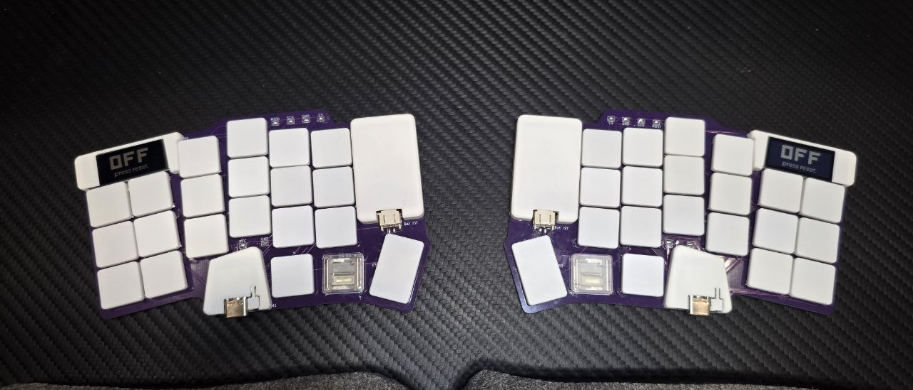

# Sucralose

Sucralose is a wireless, 42-key split keyboard built around Kailh PG1316S ultra-low-profile switches.
One reversible PCB serves both halves.

## Hardware

- **Switches:** [Kailh PG1316S](https://www.kailhswitch.com/uploads/15927/files/CPG1316S01D02-data-sheet.pdf),
  21 per half, on a 17 mm pitch to fit their smaller keycaps.
- **Controller:** Seeed XIAO nRF52840 Plus, running [ZMK](https://zmk.dev).
- **Display:** [nice!view](https://nicekeyboards.com/nice-view/), soldered flush to keep the stack low.
- **Power:** a LiPo pouch in a corner bay beside the key field, a JST-PH connector, and a side slide switch.
  An optional side reset button is also supported.
- **PCB:** 1 mm thick, so the full stack stays in ultra-low-profile range.

## Design

- **Layout:** the column splay is inspired by [chalk](https://github.com/maurzo/chalk).
  The 1.5u outer thumb key comes from the [Corne](https://github.com/foostan/crkbd).
- **Reversible:** each half uses the same board, flipped.
  - The XIAO footprint puts a land on both copper layers at every pin.
    Each layer carries the net that pin needs when the module is mounted on that side.
  - The nice!view header can't do that because its pins are plated through-holes.
    Four solder jumpers per side select its pin order instead.
- **Serviceable switches:** the PG1316S contacts sit under the switch body.
  The custom footprint uses plated through-holes so each joint can be reflowed from the underside.

## Custom Footprints

These live in `lib/footprints.pretty/`. The files ending in `_sucralose` were drawn for this board.

- **PG1316S:** a reversible footprint with plated through-holes and locating-pin holes.
  It builds on [mikefive](https://github.com/mikeholscher/zmk-config-mikefive)'s footprints and
  [marbastlib](https://github.com/ebastler/marbastlib)'s.
- **XIAO nRF52840 Plus:** a reversible version of Seeed's official single-sided footprint.
- **nice!view:** a dual-sided header, plus chevron solder jumpers for net selection.
- **Alps SSSS811101 power switch:** front and back versions, checked against
  [ceoloide's footprints](https://github.com/ceoloide/ergogen-footprints).
- **Other parts:** a reversible B3U reset button and SOD-123 diodes.

## Case

`case/out/` has STL files for the partial covers: a battery cover and battery plate, left and right XIAO covers, and a screen cover.
It also has left and right reference DXFs showing the outline, keycap clearances, and M1 screw holes.

## Firmware

This repo is also the [ZMK module](https://zmk.dev/docs/features/modules) for the board: `firmware/` holds the
`sucralose_left` / `sucralose_right` shield. See [`firmware/README.md`](firmware/README.md) for how to build it.

## License

Sucralose is released under the [MIT License](LICENSE).

The key switch layout is the exception. To the extent it is unchanged from [chalk](https://github.com/maurzo/chalk) by maurzo,
that layout stays under chalk's [CC BY-NC-SA 4.0](https://creativecommons.org/licenses/by-nc-sa/4.0/) license.
Third-party files in `reference/` and the footprints derived from upstream libraries also keep their own licenses.

## Credits

- **Corne:** [foostan/crkbd](https://github.com/foostan/crkbd), CC-BY-4.0.
- **Key switch layout:** [maurzo/chalk](https://github.com/maurzo/chalk) by maurzo, CC-BY-NC-SA-4.0.
- **PG1316S footprints:** [mikeholscher/zmk-config-mikefive](https://github.com/mikeholscher/zmk-config-mikefive)
  and [ebastler/marbastlib](https://github.com/ebastler/marbastlib), CERN-OHL-P.
